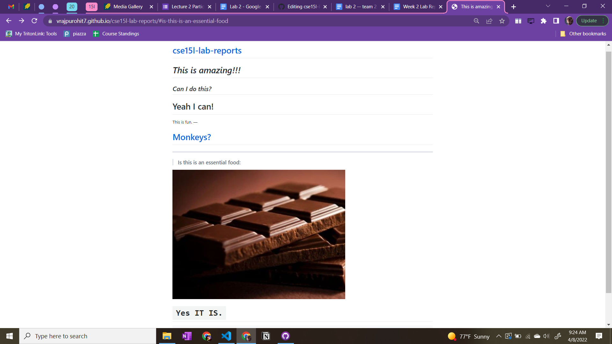

# ***Remote Access***
### Here's a Step-by-Step process on how to log into a course-specific account on `ieng6`.
Hi!

## 1. Installing VScode
## 2. Remotely Connecting
## 3. Trying Some Commands
## 4. Moving Files with `scp`
## 5. Setting an SSH Key
## 6. Optimizing Remote Running

### I hope this tutorial helped in underestanding how to setup remote access and to log into a course-specific account on `ieng6`.

# Thank you!
## Have a nice day...

[Index page](https://vrajpurohit7.github.io/cse15l-lab-reports/index.html)
---

---
[Lab Report 1](bla.html)
---
[Lab Report 1](https://vrajpurohit7.github.io/cse15l-lab-reports/lab-report-1-week-2.html)
