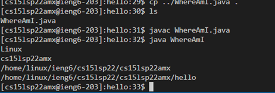
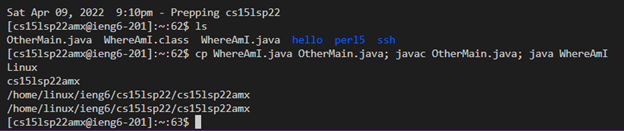

# ***Remote Access***
### Here's a Step-by-Step process on how to log into a course-specific account on `ieng6`.

## 1. Installing VScode
- Go to the Visual Studio Code website https://code.visualstudio.com/, and follow the instructions to download and install it on your computer. There are versions for all the major operating systems, like OSX (for Macs) and Windows (for PCs).
- When it is installed, you should be able to open a window that looks like this (it might have different colors, or a different menu bar, depending on your system and settings):


## 2. Remotely Connecting
- If you’re on Windows, install a program called OpenSSH, which is a program that can connect your computer to other computers that have this kind of account:
[Install OpenSSH](https://docs.microsoft.com/en-us/windows-server/administration/openssh/openssh_install_firstuse)
- Then, look up your course-specific account for CSE15L here:
https://sdacs.ucsd.edu/~icc/index.php
- Then, in Visual Studio Code, we are going to connect to the remote computer using VSCode’s remote option. For reference, we’re following the steps in the [Connect to a remote host](https://code.visualstudio.com/docs/remote/ssh#_connect-to-a-remote-host) step.
1. Open a terminal in VSCode (Ctrl + `, or use the Terminal → New Terminal menu option). Your command will look like this, but with the "zz" replaced by the letters in your course-specific account.

```
$ ssh cs15lsp22zz@ieng6.ucsd.edu
```
- Since this is likely the first time you’ve connected to this server, you will probably get a message like this:
```
⤇ ssh cs15lsp22zz@ieng6.ucsd.edu
The authenticity of host 'ieng6.ucsd.edu (128.54.70.227)' can't be established.
RSA key fingerprint is SHA256:ksruYwhnYH+sySHnHAtLUHngrPEyZTDl/1x99wUQcec.
Are you sure you want to continue connecting (yes/no/[fingerprint])?
```
- Say yes to these messages when you are connecting to a new server for the first time; it’s expected to get this message in that case. If you get this message when you’re connecting to a server you connect too often, it could mean someone is trying to listen in on or control the connection.

- So type `yes` and press enter, then give your password; the whole interaction should look something like this once you give your password and are logged in:
```
⤇ ssh cs15lsp22zz@ieng6.ucsd.edu
The authenticity of host 'ieng6-202.ucsd.edu (128.54.70.227)' can't be established.
RSA key fingerprint is SHA256:ksruYwhnYH+sySHnHAtLUHngrPEyZTDl/1x99wUQcec.
Are you sure you want to continue connecting (yes/no/[fingerprint])? 
Password: 
Last login: Sun Jan  2 14:03:05 2022 from 107-217-10-235.lightspeed.sndgca.sbcglobal.net
quota: No filesystem specified.
Hello cs15lsp22zz, you are currently logged into ieng6-203.ucsd.edu

You are using 0% CPU on this system

Cluster Status 
Hostname     Time    #Users  Load  Averages  
ieng6-201   23:25:01   0  0.08,  0.17,  0.11
ieng6-202   23:25:01   1  0.09,  0.15,  0.11
ieng6-203   23:25:01   1  0.08,  0.15,  0.11

Sun Jan 02, 2022 11:28pm - Prepping cs15lsp22
```

- Now your terminal is connected to a computer in the CSE basement, and any commands you run will run on that computer! We call your computer the client and the computer in the basement the server based on how you are connected.

## 3. Trying Some Commands
- Try running the commands `cd`, `ls`, `pwd`, `mkdir`, and `cp` a few times in different ways, both on your computer, and on the remote computer after ssh-ing.
- Here are some specific useful commands to try:
1. `cd ~`
2. `cd`
3. `ls -lat`
4. `ls -a`
5. `ls <directory>` where <directory> is `/home/linux/ieng6/cs15lsp22/cs15lsp22abc`, where the `abc` is one of the other group members’ username
6. `cp /home/linux/ieng6/cs15lsp22/public/hello.txt ~/`
7. `cat /home/linux/ieng6/cs15lsp22/public/hello.txt`


Hint: To log out of the remote server in your terminal, you can use:

- Ctrl-D
- Run the command exit

You can also open more terminals in VSCode (there is a little + button at the top of the terminal window where you can create another).

## 4. Moving Files with `scp`
So far we’ve seen how we can do some work on local and remote computers. One key step in *working remotely* is being able to copy files back and forth between the computers. There are lots of options for how to do this – you might have done it yourself in the past by sending yourself an email, or storing it in Google Drive or Dropbox and accessing it from another computer later.

We’ll now see another way to copy a file (or many files!) from your computer to a remote computer. The command is called `scp`, and we will always run it from the client (that means from your computer, not logged into `ieng6`). Create a file on your computer called WhereAmI.java and put the following contents into it:
```
class WhereAmI {
  public static void main(String[] args) {
    System.out.println(System.getProperty("os.name"));
    System.out.println(System.getProperty("user.name"));
    System.out.println(System.getProperty("user.home"));
    System.out.println(System.getProperty("user.dir"));
  }
}
```
Run it using `javac` and `java` on your computer. (If you don’t have java installed on your computer, skip this step).

Then, in the terminal from the directory where you made this file, run this command (as usually, using your username):

`scp WhereAmI.java cs15lsp22zz@ieng6.ucsd.edu:~/`

You should be prompted for a password just like when you log in with `ssh`.

Then, log into ieng6 with ssh again, and use `ls`. You should see the file there in your home directory!

Now you can run it on the *ieng6 computer* using `javac` and `java`.



## 5. Setting an SSH Key
So far, we’ve seen how to log in, run commands, and copy files to a remote server with `ssh` and `scp`. Every time we log in or run `scp`, we have to type (or copy-paste) our password. This is frustrating, time consuming, and interrupts whatever task we were trying to do. 

Naturally, we should look into if there are ways to avoid this repetitive, frustrating task with a configuration or program.

In this case, there is a great solution – `ssh` keys. The idea behind ssh keys is that a program, called `ssh-keygen`, creates a pair of files called the *public key* and *private key*. 

You copy the public key to a particular location on the server, and the private key in a particular location on the client. 

Then, the `ssh` command can use the pair of files in place of your password. This is a common setup step in lots of work environments that involve code on a server.

Here’s what you should run to set this up:
```
# on client (your computer)
$ ssh-keygen
Generating public/private rsa key pair.
Enter file in which to save the key (/Users/<user-name>/.ssh/id_rsa): /Users/<user-name>/.ssh/id_rsa
Enter passphrase (empty for no passphrase):
```
Note: Make sure that you do not add a passphrase for this step.
```
Enter same passphrase again: 
Your identification has been saved in /Users/<user-name>/.ssh/id_rsa.
Your public key has been saved in /Users/<user-name>/.ssh/id_rsa.pub.
The key fingerprint is:
SHA256:jZaZH6fI8E2I1D35hnvGeBePQ4ELOf2Ge+G0XknoXp0 <user-name>@<system>.local
The key's randomart image is:
+---[RSA 3072]----+
|                 |
|       . . + .   |
|      . . B o .  |
|     . . B * +.. |
|      o S = *.B. |
|       = = O.*.*+|
|        + * *.BE+|
|           +.+.o |
|             ..  |
+----[SHA256]-----+
```
- If you’re on Windows, follow the extra ssh-add steps [here](https://docs.microsoft.com/en-us/windows-server/administration/openssh/openssh_keymanagement#user-key-generation).

This created two new files on your system; the private key (in a file `id_rsa`) and the public key (in a file `id_rsa.pub`), stored in the `.ssh` directory on your computer.

Now we need to copy the *public* (not the private) key to the `.ssh` directory of your user account on the server.
```
$ ssh cs15lsp22zz@ieng6.ucsd.edu
<Enter Password>
# now on server
$ mkdir .ssh
$ <logout>
# back on client
$ scp /Users/<user-name>/.ssh/id_rsa.pub cs15lsp22zz@ieng6.ucsd.edu:~/.ssh/authorized_keys
# You use your username and the path you saw in the command above
```
Once you do this, you should be able to `ssh` or `scp` from this client to the server without entering your password.


## 6. Optimizing Remote Running
Here are a few ways to make this process more pleasent for making a *local* edit.
- You can write a command in quotes at the end of an `ssh` command to directly run it on the remote server, then exit. For example, this command will log in and list the home directory on the remote server:

`$ ssh cs15lsp22zz@ieng6.ucsd.edu "ls"`
- You can use semicolons to run multiple commands on the same line in most terminals. For example, try:
```
$ cp WhereAmI.java OtherMain.java; javac OtherMain.java; java WhereAmI
```
- You can use the up-arrow on your keyboard to recall the last command that was run




### I hope this tutorial helped in underestanding how to setup remote access and to log into a course-specific account on `ieng6`.

# Thank you! 
## Hope you have a nice day...
---

Credits:

Week 1 Lab - for conent

Group 1 Lab 1 assignment - for images.

[Lab Report 1](https://vrajpurohit7.github.io/cse15l-lab-reports/lab-report-1-week-2.html)