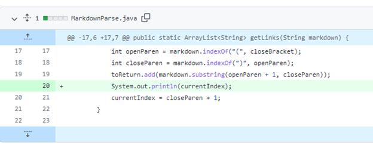

# *Changes made in the code to fix a bug*

## 1) Including print statement:
Faliure inducing input: [Test file 1](https://github.com/vrajpurohit7/markdown-parser/blob/main/test-file.md)

The above test file causes an infinite loop to run:

We solved the issue by adding a print statement:

Adding this print statement helped check how the current index was changing and thus help figure out what caused the infinity loop.

## 2) Adding an if-statement:
Faliure inducing input: [Test file 2](https://github.com/vrajpurohit7/markdown-parser/blob/main/testfile2.md)

The above test case causes an Index out of Bound error:

We solve this issue by including an if-statement:
 

This monitors the indexs and doesn't let the code give an out of bound error.

## 3) Addresing invalid links:
Faliure inducing input: [Test file 3]()

The above test file caused wrong printing of the links:

We solved this issue by implimenting a for loop and if statements:

These lines made sure that any invalid links are not being added and printed out as the results.