# *Streamline `ssh`, GitHub Access, Copy Directories*

## Streamlining ssh Configuration:
Logging into the remote server from the local machiene can be really fustrating when we need to type such long lines of code:

`$ ssh cs15lsp22amx@ieng6.ucsd.edu`

Instead, if we are able to login in with just typing `ssh ieng6` why would we trouble ourselves unnecessarily?

So, here's how we can do it:

1. In your terminal, try opening `~/.ssh/config` (on your computer, creating it if it doesn’t exist), and add the following lines of code:
```
Host ieng6
    HostName ieng6.ucsd.edu
    User cs15lsp22zzz (use your username)
```
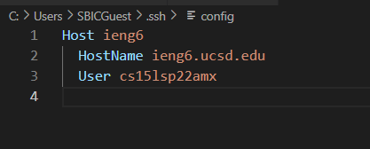

2. Then try this command: `ssh ieng6`. 

If things are set up correctly, this should use the key and log you in with the username you specified using your public key.

If this doesn’t work, you can try adding a line to explicitly refer to your id_rsa file:
```
Host ieng6
    HostName ieng6.ucsd.edu
    User cs15lsp22zzz (use your username)
    IdentityFile ~/.ssh/id_rsa
 ```
Note that paths may look a little different on Windows, they may use \ instead of / for instance. 

In the end it's supposed to look like so:

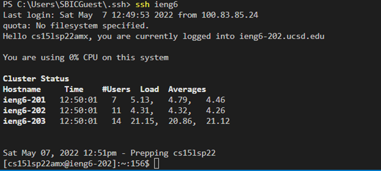
### `scp` a file into remote server using just `ssh ieng6`:
Now when you create a file on your local computer and want to copy it to the remote one, do the following:

1. Create a `.txt` file and `scp` it to the remote server.
2. Login into the remote server using `ssh ieng6` command.
3. Type `ls` to see the contents on the server.

You should see your file there:

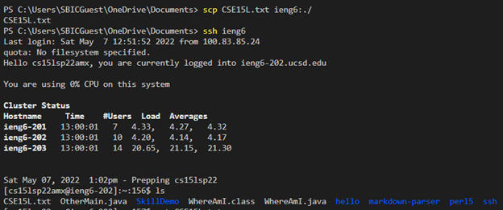

---
## Set up Github Access from ieng6:
The public key that we make is stored in the **SSH and GPG keys** tab under the settings in GitHub website.

When go there, it should look something like this:

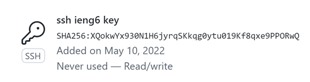

And to access the private key, we can go on our remote server and follow these steps:

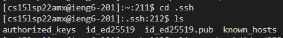

The **id_ed25519.pub** file holds the private key.

Now we are running git commands to commit and push a change to Github while logged into our ieng6 account. The changes look like follows:

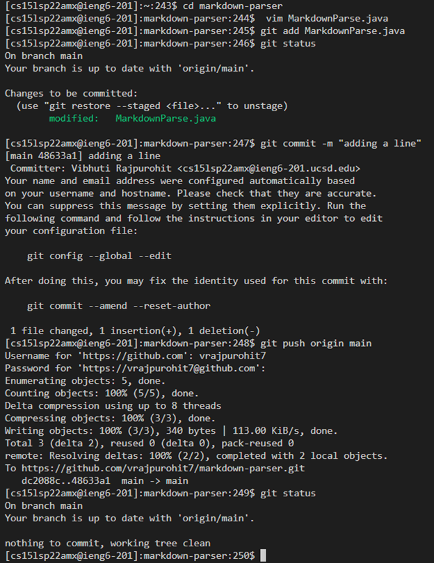

Here, for the password, the key doesn't work for me so I had to use a GitHub personal access token (PAT).

And here's the link for the resulting commit and the screenshot.
[Link](https://github.com/vrajpurohit7/markdown-parser/commit/dc2088c6db10b35faac045211a9678e59c85206f)

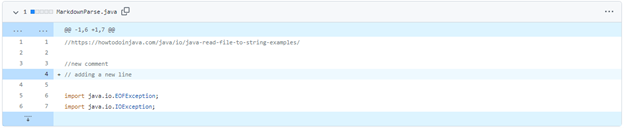

---
## Copying whole directories with `scp -r` :
Here we are going to copy the entire `markdown-parser` directory. The following shows how it is done:

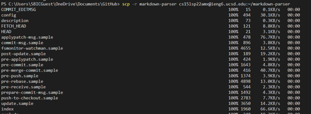
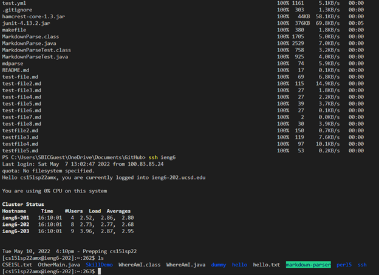

So in the last line we can see that markdown-parser repository has been added to the `ieng6` account.

Now we shall compile and run the files in the `ieng6` account. To do so follow these:


Now we repeat the entire thing but only run it in one line. This can be done by inserting the following into the terminal:

```
scp -r markdown-parser cs15lsp22amx@ieng6.ucsd.edu:~;ssh 
ieng6 "cd markdown-parser; /software/CSE/oracle-java-17/jdk-17.0.1/bin/javac -cp .:lib/junit-4.13.2.jar:lib/hamcrest-core-1.3.jar MarkdownParseTest.java; /software/CSE/oracle-java-17/jdk-17.0.1/bin/java -cp .:lib/junit-4.13.2.jar:lib/hamcrest-core-1.3.jar org.junit.runner.JUnitCore MarkdownParseTest"
```
It should look something like:

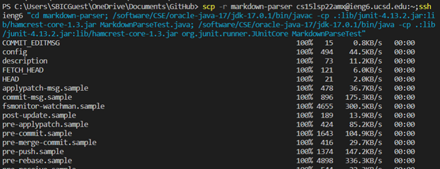
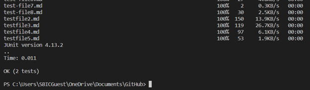

## That's it for this lab report! See you again~