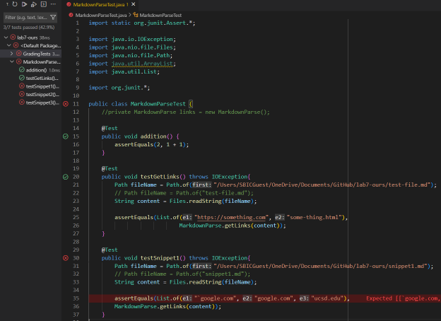
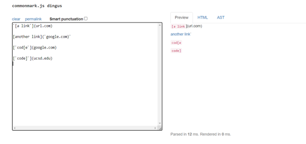
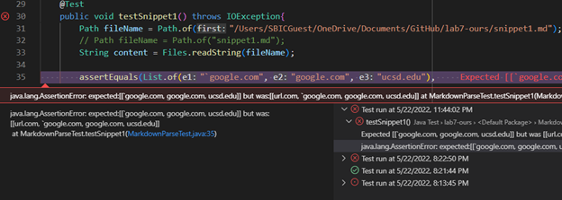
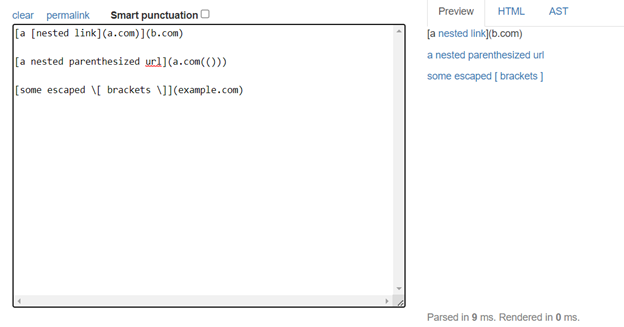
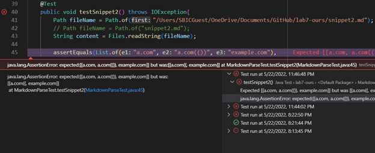
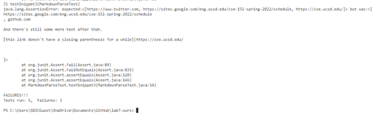

[My team's repository](https://github.com/HantianLin/markdown-parser)

[Other team's repository](https://github.com/michellem8/markdown-parser)
___

## My `MarkdownParseTest.java` file:



## Snippet 1
Test file for Snippet 1:
```
`[a link`](url.com)

[another link](`google.com)`

[`cod[e`](google.com)

[`code]`](ucsd.edu)
```
Expected output for Snippet 1 test file:



The Test failed for our code and the error is as shown:


The test also failed for the other team and we had the same wrong output as above.

---
## Snippet 2
Test file for Snippet 2:
```
[a [nested link](a.com)](b.com)

[a nested parenthesized url](a.com(()))

[some escaped \[ brackets \]](example.com)

```
Expected output for Snippet 2 test file:



The Test failed for our code and the error is as shown:


The test also failed for the other team and we had the same wrong output as above.

---
## Snippet 3
Test file for Snippet 3:
```
[this title text is really long and takes up more than 
one line

and has some line breaks](
    https://www.twitter.com
)

[this title text is really long and takes up more than 
one line](
https://sites.google.com/eng.ucsd.edu/cse-15l-spring-2022/schedule
)


[this link doesn't have a closing parenthesis](github.com

And there's still some more text after that.

[this link doesn't have a closing parenthesis for a while](https://cse.ucsd.edu/


)

And then there's more text

```
Expected output for Snippet 3 test file:


The Test failed for our code and the error is as shown:


The test also failed for the other team and we had the same wrong output as above.