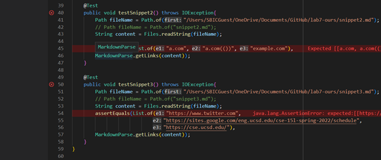
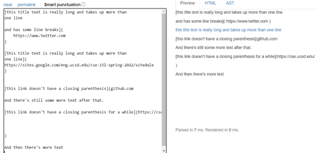

[My team's repository](https://github.com/HantianLin/markdown-parser)

[Other team's repository](https://github.com/michellem8/markdown-parser)

### My `MarkdownParseTest.java` file:



## Snippet 1
Test file for Snippet 1:
```
`[a link`](url.com)

[another link](`google.com)`

[`cod[e`](google.com)

[`code]`](ucsd.edu)
```
Expected output for Snippet 1 test file:


The Test failed for our code and the error is as shown:


The test also failed for the other team and we had the same wrong output as above.

---
## Snippet 2
Test file for Snippet 2:
```
[a [nested link](a.com)](b.com)

[a nested parenthesized url](a.com(()))

[some escaped \[ brackets \]](example.com)

```
Expected output for Snippet 2 test file:


The Test failed for our code and the error is as shown:


The test also failed for the other team and we had the same wrong output as above.

---
## Snippet 3
Test file for Snippet 3:
```
[this title text is really long and takes up more than 
one line

and has some line breaks](
    https://www.twitter.com
)

[this title text is really long and takes up more than 
one line](
https://sites.google.com/eng.ucsd.edu/cse-15l-spring-2022/schedule
)


[this link doesn't have a closing parenthesis](github.com

And there's still some more text after that.

[this link doesn't have a closing parenthesis for a while](https://cse.ucsd.edu/


)

And then there's more text

```
Expected output for Snippet 3 test file:



The Test failed for our code and the error is as shown:


The test also failed for the other team and we had the same wrong output as above.

## Questions:
1. Do you think there is a small (<10 lines) code change that will make your program work for snippet 1 and all related cases that use inline code with backticks?
- I think that having a few 'if' statements can exclude any invalid links from being returned as outputs.

2. Do you think there is a small (<10 lines) code change that will make your program work for snippet 2 and all related cases that nest parentheses, brackets, and escaped brackets?
- I do think that this bug can be addressed but am not completely sure how exactly or if the additional lines of code would be less than 10. When comming across multiple brackets or parentheses, the code shoud be able note them down and check if all opened brackets do close. If not then the link might be invalid and it shouldn't be returning it. 

3. Do you think there is a small (<10 lines) code change that will make your program work for snippet 3 and all related cases that have newlines in brackets and parentheses?
- Honestly, this test case is the toughest for me and so I think we would require more than 10 lines of code to address all possible edge cases like link continuing in more than one lines, or link not having a closing parenthesis, or having multiple blank lines in between and even having some texts scattered randomly.