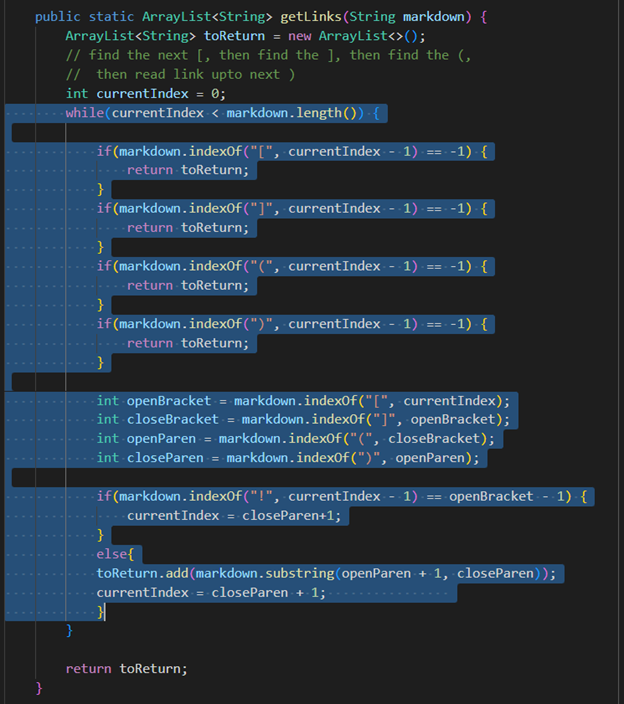
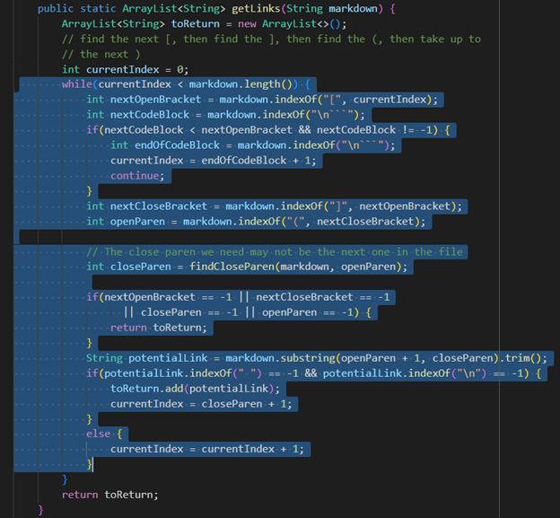

## Finding test cases with different results:
To check where the results of my own code and the provided code differ, I first saved the results from both codes into new files and then compared them using `vimdiff` command in the terminal.

The command:  `vimdiff my-markdown-parser/results.txt cse15lsp22-markdown-parser/results.txt`

The output:

## Test file 1:

[Link](https://github.com/nidhidhamnani/markdown-parser/blob/main/test-files/12.md)

### Expected Output: [ ]

As the result:  !"#$%&'()*+,-./:;<=>?@[\]^_`{|}~  -> Is not a link

I used the VSCode preview to se what the implimentation should result in.

### Actual Output:

The result on the left side is from my code and on the right side is from the given code.

Thus we can clearly see that the result from the provided code is correct as it matches the Expected results.

### Possible bug in my code:
My implimentation of the code might not be working properly because it is not looking for brackets properly. An indication that a link is supposed to start is "[ ]" then everything inside of "( )" could possibly be a valid link. 

Thus the bug in the code could be in these parts:

## Test file 2:

[Link](https://github.com/nidhidhamnani/markdown-parser/blob/main/test-files/504.md)

### Expected Output: [/url "title", /url 'title', /url (title)]

As the result:
[link](/url "title")
[link](/url 'title')
[link](/url (title)) -> are all links

I used the VSCode preview to se what the implimentation should result in.

### Actual Output:

The result on the left side is from my file and on the right side is from the given code.

Thus we can clearly see that neither of the result are entirely correct as they do not match the Expected results. But my implimentation of the code seems to be partially correct.

### Possible bug in the provided code:
The implimentation of the provided code might not be working properly because it is not reading the content within the brackets properly. It might be assuming that some of the elements within "( )" could possibly be an invalid link due to special charaters like extra "()" existing withing the given link. But this is wrong because few of the actual links could possibly have such special characters. 

Thus the bug in the code could be in these parts:

