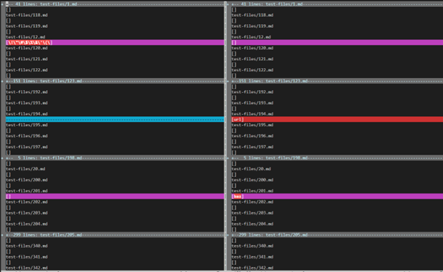
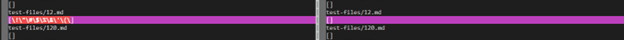

## Finding test cases with different results:
To check where the results of my own code and the provided code differ, I first saved the results from both codes into new files and then compared them using `vimdiff` command in the terminal.

The command:  `vimdiff my-markdown-parser/results.txt cse15lsp22-markdown-parser/results.txt`

The output:

## Test file 1:

[Link](https://github.com/nidhidhamnani/markdown-parser/blob/main/test-files/12.md)

### Expected Output: [ ]

As:  !"#$%&'()*+,-./:;<=>?@[\]^_`{|}~  -> Is not a link

### Actual Output:

The result on the left side is from my code and on the right side is from the given code.

Thus we can clearly see that the result from the provided code is correct as it matches the Expected results.

## Test file 2:

[Link](https://github.com/nidhidhamnani/markdown-parser/blob/main/test-files/504.md)

### Expected Output: [/url "title", /url 'title', /url (title)]

As:
[link](/url "title")
[link](/url 'title')
[link](/url (title)) -> are all links

### Actual Output:

The result on the left side is from my file and on the right side is from the given code.

Thus we can clearly see that neither of the result are entirely correct as they do not match the Expected results.